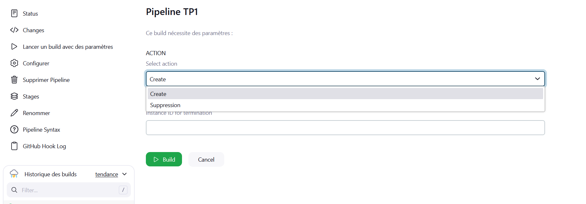
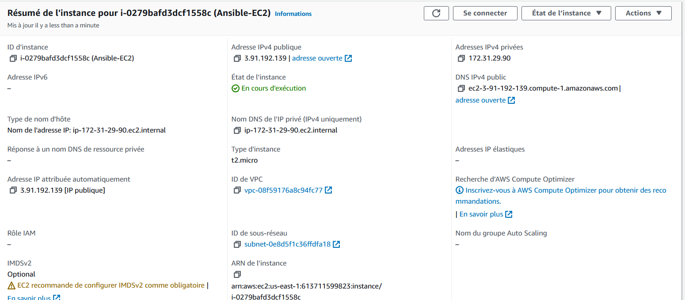
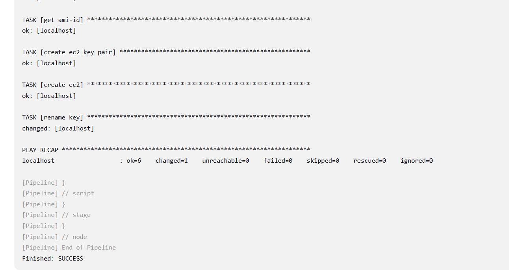

TP1 ATHUIL David /PIZZO Valentin

Voici le pipeline ainsi que les 3 print screen prouvant qu'en lancant git ou en build par parametre j'ai bien une instance cree par ansible depuis jenkins sur aws

pipeline {
  agent any
  parameters {
    choice(name: 'ACTION', choices: ['Create', 'Suppression'], description: 'Select action')
    string(name: 'INSTANCE_ID', defaultValue: '', description: 'Instance ID for termination')
    
  }
  stages {
    stage('Checkout') {
      steps {
        git branch: 'main', url: 'https://github.com/davidathuil/INFRA-DEPLOY-AWS-JENKINS.git'
      }
    }

    stage('Execute Ansible') {
      steps {
        script {
          if (params.ACTION == 'Create') {
             ansiblePlaybook playbook: '/etc/ansible/create_ec2.yml', inventory: 'localhost'
            
          } else if (params.ACTION == 'Terminate') {
            ansiblePlaybook playbook: 'delete_ec2.yml ', inventory: 'localhost', extraVars: [instance_id: params.INSTANCE_ID]
          } else {
            error "Invalid action selected. Please choose either 'Create' or 'Terminate'."
        }
      }
    }
  }
}
}

